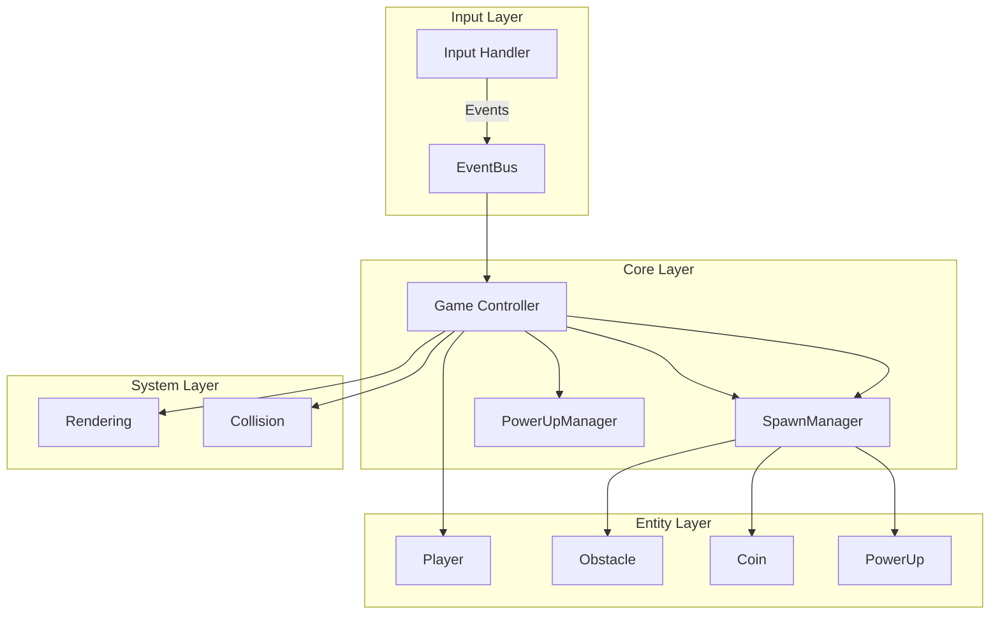
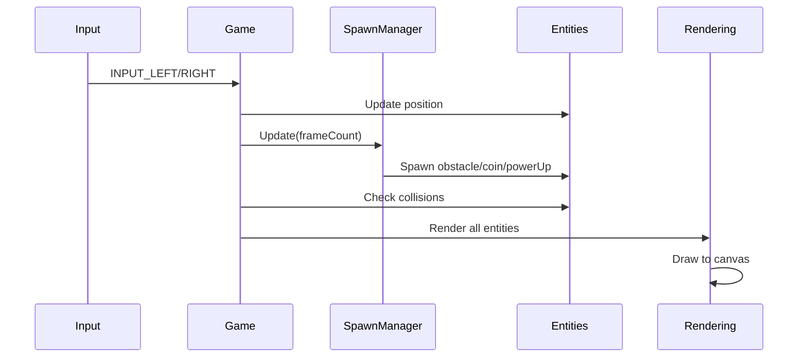
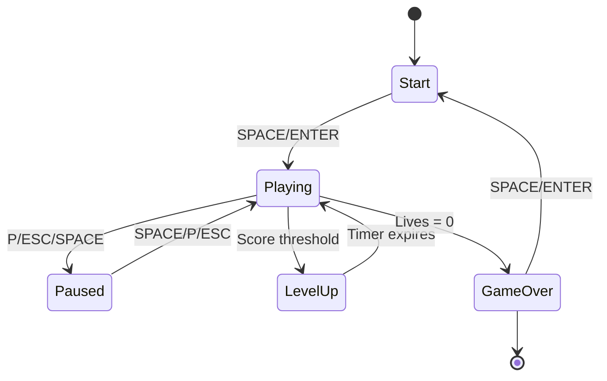
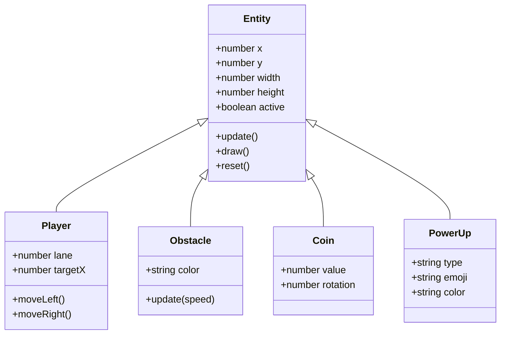

# Crazy Car System Design

## Overview

Crazy Car is a real-time HTML5 arcade driving game with modular architecture. Players navigate through traffic, collect power-ups, and progress through increasingly challenging levels.

**Key Features:**
- 3-level progression system (Beginner → Intermediate → Expert)
- 5 power-ups with weighted distribution
- Fair random distribution (Fisher-Yates shuffle)
- Object pooling for performance
- Touch controls for mobile

## Architecture

## Modules

| Module | Description | Link |
|--------|-------------|------|
| **core** | Game controller, input handling, event bus | [core/](core/README.md) |
| **entities** | Game entities (Player, Obstacle, Coin, PowerUp) | [entities/](entities/README.md) |
| **systems** | Game systems (Rendering, Collision, Spawn, PowerUp) | [systems/](systems/README.md) |
| **utils** | Utilities (ObjectPool, WeightedPool, LaneSequence) | [utils/](utils/README.md) |

## Technical Decisions

### ES6 Modules
- **Decision**: Split monolithic 800-line file into 15+ modules
- **Rationale**: Better maintainability, code reuse, testing

### Object Pooling
- **Decision**: Pre-allocate entities (obstacles, coins, power-ups)
- **Rationale**: Reduce GC pressure, improve performance at 60fps

### Fair Random Distribution
- **Decision**: Fisher-Yates shuffle for lanes and weighted pool for power-ups
- **Rationale**: Short-term fairness, prevents clustering

### Single-File Build
- **Decision**: Use Vite + vite-plugin-singlefile
- **Rationale**: Easy deployment, no server required

## Data Flow

## Game State Machine

## Data Model

## Performance Targets

| Metric | Target | Actual |
|--------|--------|--------|
| Frame Rate | 60 fps | ✅ 60 fps |
| Build Size | < 25 KB | ✅ 21.92 KB |
| Test Coverage | Core systems | ✅ 87 tests |
| Load Time | < 1s | ✅ Instant |

---

**Last Updated**: 2026-02-27  
**Version**: 1.0.0
