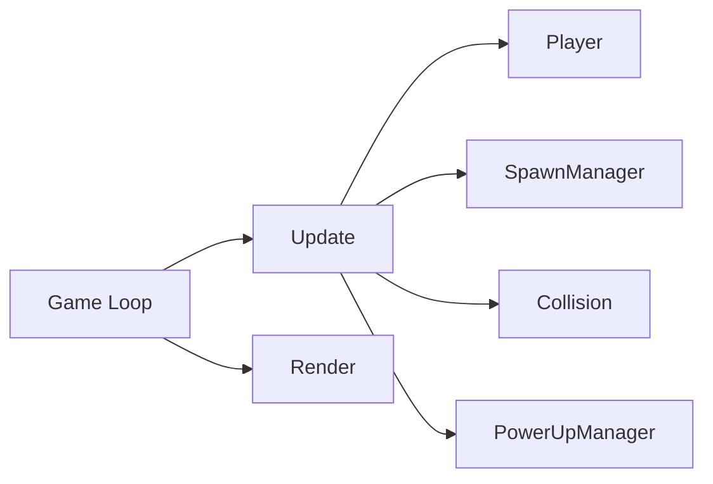
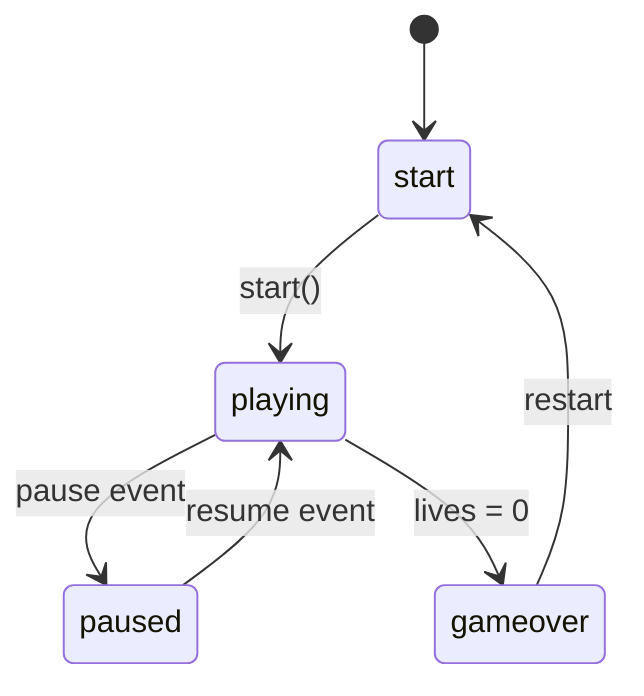
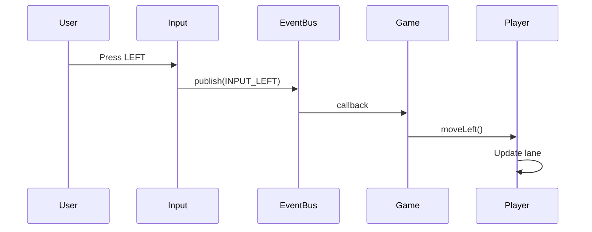

# Core Module Design

## Overview

The core module handles game state management, user input, and event-driven communication between systems.

## Components

### Game Controller

**Responsibility**: Main game loop, state management, system coordination



**Key Methods**:
- `constructor(canvas)` - Initialize systems
- `gameLoop()` - 60fps update/render cycle
- `start()` - Reset game state
- `gameOver()` - Handle game end
- `update()` - Update all systems
- `render()` - Draw all entities

### Input Handler

**Responsibility**: Keyboard and touch input, event publishing

**Events Published**:
| Event | Trigger |
|-------|---------|
| `INPUT_LEFT` | ← / A key, swipe left |
| `INPUT_RIGHT` | → / D key, swipe right |
| `INPUT_ACTION` | SPACE / ENTER |
| `INPUT_PAUSE` | P / ESC |

### EventBus

**Responsibility**: Decoupled publish/subscribe communication

**API**:
```javascript
eventBus.subscribe(event, callback)
eventBus.publish(event, data)
eventBus.unsubscribe(event, callback)
eventBus.clear(event)
```

## Interfaces

### Public API

```javascript
// Game
const game = new Game(canvas);
game.gameLoop();
game.start();

// Input
const input = new Input();

// EventBus
eventBus.subscribe('EVENT_NAME', handler);
```

### Dependencies

- No external dependencies
- Uses native DOM APIs

## State Machine



## Data Flow



---

**Related**: [System Overview](../README.md)
