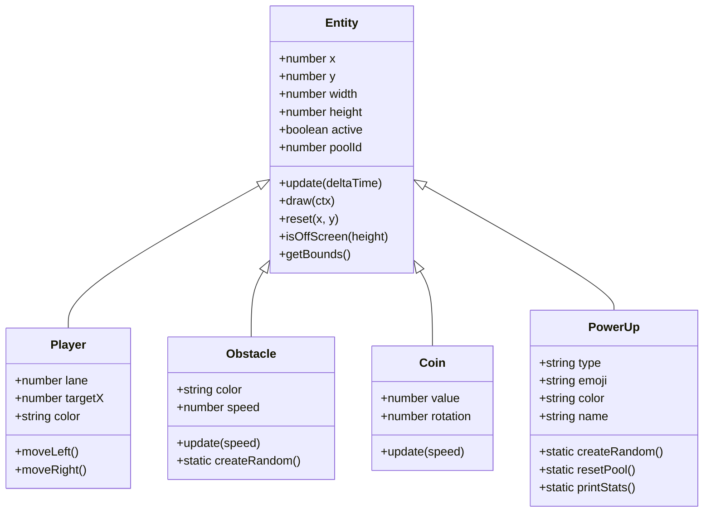
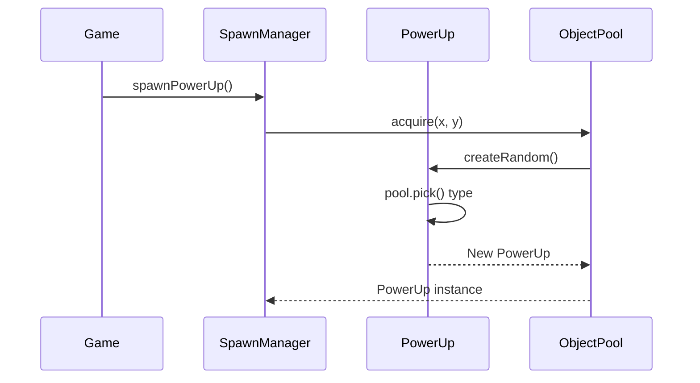

# Entities Module Design

## Overview

Entity module defines all game objects with a common base class and specialized subclasses.

## Architecture



## Components

### Entity (Base Class)

**Responsibility**: Common properties and methods for all game objects

**Properties**:
- `x, y` - Position
- `width, height` - Dimensions
- `active` - Pool availability flag
- `poolId` - Object pool identifier

### Player

**Responsibility**: Player-controlled car with lane-based movement

**Key Features**:
- 3-lane movement (0, 1, 2)
- Smooth interpolation to target lane
- Visual car design with wheels and headlights

### Obstacle

**Responsibility**: Enemy cars that move down the screen

**Features**:
- Random color from 4 options
- Lane-based positioning
- Collision detection

### Coin

**Responsibility**: Collectible items worth 100 points

**Features**:
- Rotating animation
- Gold visual design with $ symbol
- Value: 100 points

### PowerUp

**Responsibility**: Special items with temporary effects

**Types**:
| Type | Emoji | Effect | Duration |
|------|-------|--------|----------|
| EXTRA_LIFE | ❤️ | +1 life | Instant |
| SHIELD | 🛡️ | Invincibility | 5s |
| SLOW_MOTION | ⏰ | 50% speed | 5s |
| MAGNET | 🧲 | Attract coins | 5s |
| DOUBLE_SCORE | 2x | 2x points | 8s |

**Fair Distribution**:
- Uses WeightedPool (size 50)
- Guaranteed distribution per cycle:
  - EXTRA_LIFE: 4 (8%)
  - SHIELD: 11 (22%)
  - SLOW_MOTION: 11 (22%)
  - MAGNET: 11 (22%)
  - DOUBLE_SCORE: 13 (26%)

## Interfaces

### Entity Interface

```javascript
interface Entity {
  x: number;
  y: number;
  width: number;
  height: number;
  active: boolean;
  update(deltaTime: number): void;
  draw(ctx: CanvasRenderingContext2D): void;
  reset(x: number, y: number): void;
  isOffScreen(height: number): boolean;
  getBounds(): Bounds;
}
```

### Dependencies

- `constants.js` - Shared configuration
- `shuffle.js` - Fair random distribution

## Data Flow



---

**Related**: [System Overview](../README.md), [Systems Module](../systems/README.md)
