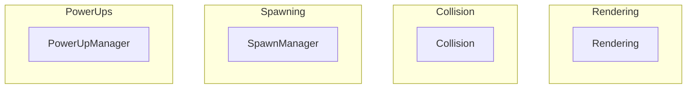
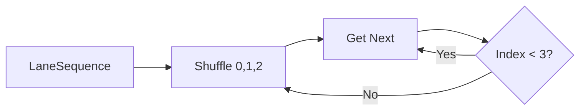
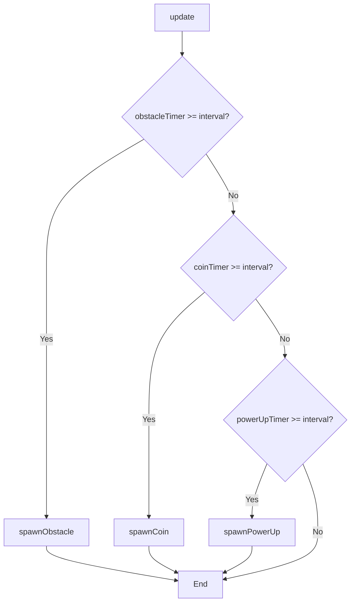
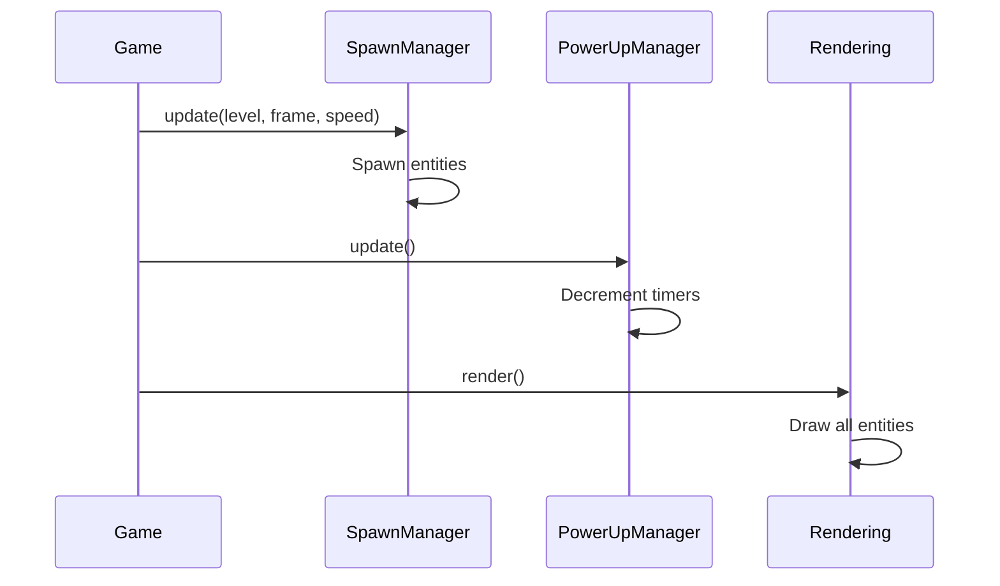

# Systems Module Design

## Overview

Systems module implements game mechanics: rendering, collision detection, spawning, and power-up management.

## Architecture



## Components

### Rendering System

**Responsibility**: Draw all game elements to canvas

**Key Methods**:
- `clear()` - Clear canvas
- `drawRoad(levelConfig)` - Draw road with level theme
- `drawRoadLines(lines)` - Animate lane dividers
- `drawEntity(entity)` - Generic entity rendering
- `drawPlayer(player, effects)` - Player with power-up effects
- `drawUI(score, level, lives)` - HUD elements
- `drawActivePowerUps(list)` - Power-up progress bars
- `drawStartScreen()` - Start menu
- `drawGameOverScreen()` - Game over display
- `drawPauseScreen()` - Pause overlay

**Visual Effects**:
| Effect | Trigger | Visual |
|--------|---------|--------|
| Shield | Active | Blue glow circle |
| Speed Boost | Active | Orange trail |
| Magnet | Active | Green dashed circle |

### Collision System

**Responsibility**: AABB collision detection

**API**:
```javascript
Collision.check(a, b)  // Entity vs Entity
Collision.checkWithBounds(entity, bounds)  // Entity vs Bounds
```

**Algorithm**: Axis-Aligned Bounding Box (AABB)
```javascript
check(a, b) {
  return a.x < b.x + b.width &&
         a.x + a.width > b.x &&
         a.y < b.y + b.height &&
         a.y + a.height > b.y;
}
```

### SpawnManager

**Responsibility**: Manage entity spawning with fair distribution

**Key Features**:
- Object pooling for obstacles, coins, power-ups
- LaneSequence for fair lane distribution (Fisher-Yates)
- Speed-adjusted spawn intervals

**Spawn Rates**:
| Entity | Base Interval | Notes |
|--------|---------------|-------|
| Obstacle | 150 frames | Scales with difficulty |
| Coin | 100 frames | Constant |
| PowerUp | 120 frames | Every 2 seconds |

**Fair Lane Distribution**:


**Spawn Logic**:


### PowerUpManager

**Responsibility**: Track and apply active power-up effects

**Key Methods**:
- `activate(type)` - Activate power-up
- `update()` - Decrement timers
- `hasEffect(effect)` - Check if effect active
- `getMultiplier()` - Score multiplier (1x or 2x)
- `getSpeedModifier()` - Speed modifier (0.5x, 1.0x, 1.5x)
- `getActiveList()` - Get active power-ups for UI

**Effect Stacking**:
- Same type: Extends duration
- Different types: Stack multiplicatively
- Speed: `speedBoost (1.5x) * slowMotion (0.5x) = 0.75x`

## Interfaces

### Public API

```javascript
// Rendering
const rendering = new Rendering(canvas);
rendering.drawPlayer(player, effects);

// Collision
const hit = Collision.check(player, obstacle);

// SpawnManager
const spawnManager = new SpawnManager();
spawnManager.update(level, frameCount, speedMultiplier);

// PowerUpManager
const powerUpManager = new PowerUpManager();
powerUpManager.activate('SHIELD');
```

### Dependencies

- `entities/` - Entity classes for rendering
- `constants.js` - Configuration values
- `utils/shuffle.js` - Fair distribution

## Data Flow



---

**Related**: [System Overview](../README.md), [Entities Module](../entities/README.md)
