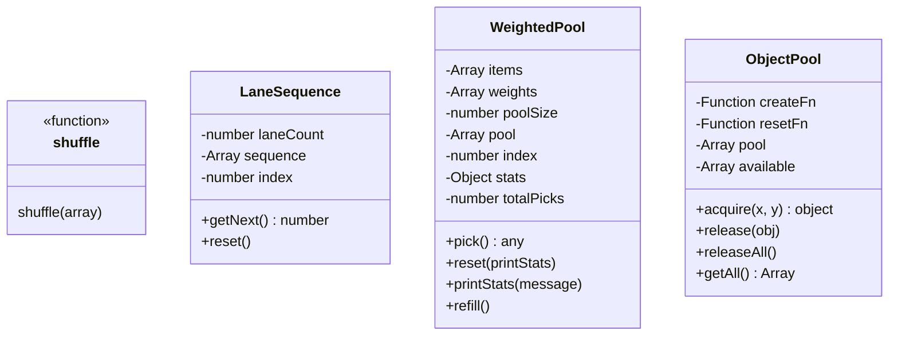
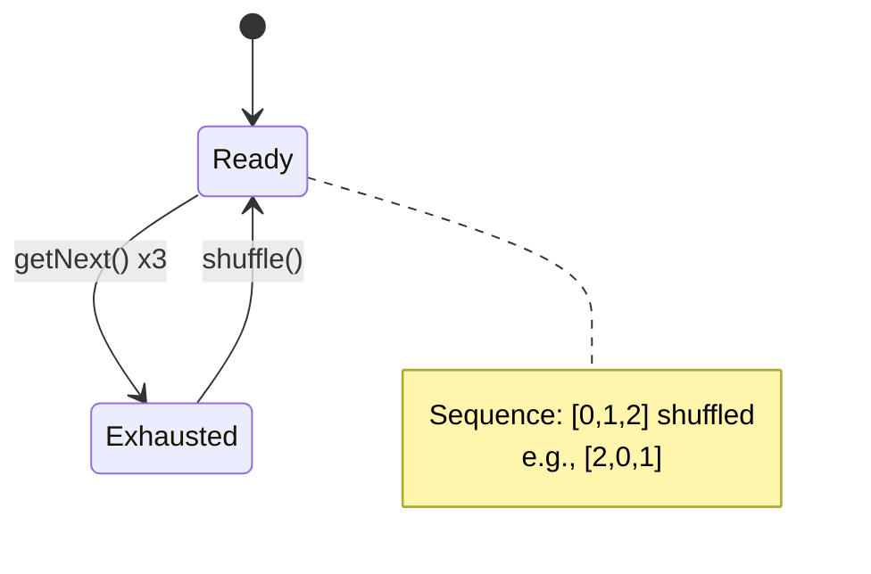
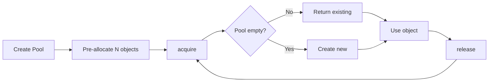
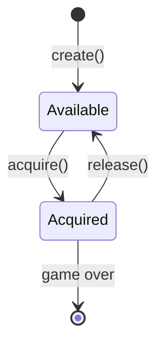

# Utils Module Design

## Overview

Utilities module provides reusable components: object pooling, fair random distribution, and weighted selection.

## Architecture



## Components

### shuffle()

**Purpose**: Fisher-Yates shuffle for fair random distribution

**Algorithm**:
```javascript
function shuffle(array) {
  for (let i = array.length - 1; i > 0; i--) {
    const j = Math.floor(Math.random() * (i + 1));
    [array[i], array[j]] = [array[j], array[i]];
  }
  return array;
}
```

**Time Complexity**: O(n)  
**Space Complexity**: O(1) - in-place shuffle

### LaneSequence

**Purpose**: Ensure each lane appears exactly once before reshuffling

**Use Case**: Obstacle/coin/power-up lane selection

**Behavior**:


**Example**:
```javascript
const seq = new LaneSequence(3);
seq.getNext(); // 2
seq.getNext(); // 0
seq.getNext(); // 1
seq.getNext(); // Reshuffles, returns new lane
```

### WeightedPool

**Purpose**: Fair weighted random selection with short-term distribution guarantees

**Use Case**: Power-up type selection

**Configuration**:
- Default pool size: 50
- Weights: EXTRA_LIFE(8), SHIELD(22), SLOW_MOTION(22), MAGNET(22), DOUBLE_SCORE(26)

**Distribution per 50 picks**:
| Type | Weight | Count |
|------|--------|-------|
| EXTRA_LIFE | 8% | 4 |
| SHIELD | 22% | 11 |
| SLOW_MOTION | 22% | 11 |
| MAGNET | 22% | 11 |
| DOUBLE_SCORE | 26% | 13 |

**Statistics Tracking**:
- `stats` - Object tracking picks per type
- `totalPicks` - Total items picked since last reset
- `printStats(message)` - Console output with emoji and percentages
- Auto-prints when pool exhausted (every 50 picks)
- Manual print via `PowerUp.printStats()` (E key in game)
- Prints on game over with "Game Over - Final Stats"

**Example Output**:
```
=== Pool exhausted (picked 50) ===
Total: 50
Distribution:
  ❤️ EXTRA_LIFE   : 4   (8.0%) [expected: 8%]
  🛡️ SHIELD       : 11  (22.0%) [expected: 22%]
  ⏰ SLOW_MOTION  : 11  (22.0%) [expected: 22%]
  🧲 MAGNET       : 11  (22.0%) [expected: 22%]
  2x DOUBLE_SCORE : 13  (26.0%) [expected: 26%]
========================
```

**Example**:
```javascript
const pool = new WeightedPool(types, weights, 50);
pool.pick();  // Returns weighted item, tracks stats
pool.printStats('Manual Check');  // Console output
pool.reset(true);  // Reset with stats print
```

### ObjectPool

**Purpose**: Pre-allocate and reuse objects to reduce GC pressure

**Use Case**: Obstacles, coins, power-ups

**Lifecycle**:


**API**:
```javascript
const pool = new ObjectPool(
  () => new Obstacle(0, 0),  // createFn
  (obj, x, y) => obj.reset(x, y),  // resetFn
  20  // initialSize
);

const obstacle = pool.acquire(x, y);
pool.release(obstacle);
pool.releaseAll();  // On game reset
```

**Performance**:
- Pre-allocation: O(n) upfront
- acquire(): O(n) to find available
- release(): O(1)
- Elimination: GC pauses during gameplay

**State Transition**:


## Interfaces

### LaneSequence

```javascript
class LaneSequence {
  constructor(laneCount: number);
  getNext(): number;
  reset(): void;
}
```

### WeightedPool

```javascript
class WeightedPool {
  constructor(items: Array, weights: Array, poolSize: number);
  pick(): any;
  reset(printStats: boolean): void;
  printStats(message: string): void;
  remaining(): number;
}
```

### ObjectPool

```javascript
class ObjectPool {
  constructor(createFn: Function, resetFn: Function, initialSize: number);
  acquire(x: number, y: number): object;
  release(obj: object): void;
  releaseAll(): void;
  getAll(): Array;
}
```

## Performance Comparison

| Approach | GC Pressure | Short-term Fair | Long-term Fair |
|----------|-------------|-----------------|----------------|
| `Math.random()` | Low | ❌ | ✅ |
| `LaneSequence` | None | ✅ | ✅ |
| `WeightedPool` | None | ✅ | ✅ |
| `ObjectPool` | None | N/A | N/A |

---

**Related**: [System Overview](../README.md)
